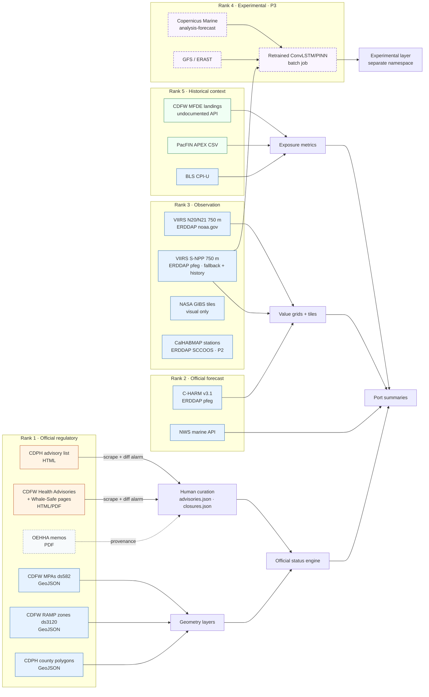

# 02 — Operational data sources

All entries were verified with live requests on **2026-10-08, 16:27–16:45 UTC** unless marked **UNVERIFIED**. Full request logs, sample values, and exact URLs are in [`evidence/`](evidence/). Nothing here should be treated as stable: each source has an automated freshness probe in the pipeline (`04-architecture.md` §6), and this file should be re-verified before each release.

Legend — **Ingest:** `auto` = scheduled fetch, published without review · `auto+review` = fetched automatically, published only after human sign-off · `curated` = human-entered record with `last_verified_by/at`, scrapers only raise change alarms · `link` = linked, not ingested.

---

## 1. Source register (MVP-relevant)

### 1.1 Official HAB forecast — C-HARM v3.1 (`charm`)

| Field | Value |
|---|---|
| Producer | NOAA NMFS SWFSC ERD (CoastWatch West Coast); C. Anderson (SCCOOS/UCSD) et al. Inputs: S-NPP VIIRS chl/Rrs (DINEOF gap-filled) + NOAA WCOFS ROMS |
| Endpoint | `https://coastwatch.pfeg.noaa.gov/erddap/griddap/wvcharmV3_{0,1,2,3}day` (0–360 lon); WMS-capable copies `wvcharmV3_{1,2,3}day_LonPM180`. **No `_LonPM180` / WMS for the nowcast (404)** |
| Version | `product_version = 3.1`. v1 (`charmForecast*day`, ended 2022-03) and v2 (`charmForecast*dayV2`, ended 2022-12 despite "2022-present" title) are **frozen — do not use**. SCCOOS/CeNCOOS pages still link to frozen v1 |
| Resolution / coverage | 0.03° (~3 km), 391 × 351; lat 31.3–43.0°N, lon −127.5 to −117.0; 2022-11-01 → present |
| Variables | `pseudo_nitzschia` = P(*Pseudo-nitzschia* > 10,000 cells/L); `particulate_domoic` = P(pDA > 500 ng/L); `cellular_domoic` = P(cDA > 10 pg/cell); plus `chla_filled`, `r486_filled`, `r551_filled`, `salinity`, `water_temparture` [sic]. Fill −99999 |
| Time semantics | `time` = **valid day** (12:00Z), not issue time. One run per day issues all leads; issue date ≈ nowcast valid date + 1 (inferred, undocumented) |
| Cadence / freshness | Daily, **with frequent missing runs** (146 gaps > 1 day since 2022-11; 54-day gap Sep–Oct 2024; 2–6-day gaps in 2026). Last verified: nowcast valid **2026-10-07**, +3-day valid **2026-10-10** |
| Spatial gotchas | No cloud gaps (gap-filled). pDA/cDA are masked 1–2 pixels further offshore than PN — piers/harbors have no toxin value; use nearest valid offshore pixel and say so |
| Skill | Peer-reviewed skill exists only for v1 (Anderson et al. 2016, *Harmful Algae* 59:1–18, doi:10.1016/j.hal.2016.08.006). **No published v3.1 skill found (UNVERIFIED)**. SCCOOS Dec 2022 bulletin notes salinity errors degrade pDA and PN has many false positives |
| License | "May be used and redistributed for free but is not intended for legal use… no legal liability." No key |
| Constraints | Intermittent HTTP 503s (retry with backoff); no issue-time field; dataset citation string not published |
| Ingest | `auto` — daily pull of all four leads, clip to CA nearshore, render tiles + value grids ourselves (needed anyway for the nowcast) |
| Freshness SLA | `current` if nowcast valid ≤ 2 days old; `stale` 3–7 days; `failed` > 7 days or fetch error |

### 1.2 Observation — VIIRS chlorophyll (`viirs_chl`)

| Role | Dataset (server) | Res | Coverage | Last obs verified | Latency | Notes |
|---|---|---|---|---|---|---|
| **Primary** | `noaacwN20VIIRSchlaSectorUSDaily` (coastwatch.noaa.gov) | 0.0075° (~750 m) | lat 0–60, lon −142 to −52; **rolling archive from 2026-02-01** | 2026-10-05T18:38Z | ~2.9 d | `chlor_a` mg m⁻³, `l2_flags`, `qa_score`; WMS ✓; time = overpass time |
| Primary companion | `noaacwN21VIIRSchlaSectorUSDaily` (coastwatch.noaa.gov) | 0.0075° | rolling from 2026-02-09 | 2026-10-05T18:37Z | ~2.9 d | Per-pixel nanmean with N20 increases cloud-free coverage |
| **Fallback (different server)** | `erdVHNchla1day` / `3day` / `8day` (coastwatch.pfeg.noaa.gov) | 0.0075° | 2015-02-25 → present | 1d: 10-04, 3d: 10-03, 8d: 10-01 | ~4 d | S-NPP; variable **`chla`**; lat descending; also the **history/climatology source** |
| Gap-free context | `noaacwNPPN20VIIRSDINEOFDaily` (both servers) | ~9 km | 2020-05 → present | 2026-10-06 | ~2.2 d | "EXPERIMENTAL"; too coarse nearshore — regional context only, labeled "gap-filled, 9 km" |
| Science quality (validation/training) | `noaacwNPPN20S3ASCIDINEOF2kmDaily`; `noaacwNPPVIIRSSQchlaDaily` | 2 km; 4 km | 2018→; 2012→ | 09-27; 09-28 | 10–11 d | Not for live display |
| Dead / avoid | `noaacwNPPN20VIIRSchlociDaily` (ends 2021-09), `erdVH2018chla*` (ends 2022-07), `erdVHNchlamday` (stale since 2026-06), `noaacwNPPVIIRSchlaDailyVV00` (Hawaii) | | | | | |

Common: license "may be used and redistributed for free… not intended for legal use"; acknowledgement requested for NESDIS products; no key. Request gotchas: latitude descending → request `(north):(south)`; URL-encode `[ ]`; axis order `[time][altitude][lat][lon]`. Reliability: coastwatch.noaa.gov returned **502 on every endpoint from ~16:40Z** during verification; pfeg intermittent 503s.

**Ingest:** `auto`, daily. Primary = N20 ∪ N21 merge; on failure fall back to `erdVHNchla1day`; never mix products under one legend. **Freshness SLA:** `current` ≤ 4 days; `stale` 5–10; `failed` > 10.

### 1.3 Observation — NASA GIBS browse tiles (`gibs_chl`) — existing app layer

| Field | Value |
|---|---|
| Layers | `VIIRS_NOAA20_Chlorophyll_a` (default 2026-10-07), `OCI_PACE_Chlorophyll_a` (default 2026-10-08), also `VIIRS_NOAA21_Chlorophyll_a`, `S3A/S3B_OLCI_Chlorophyll_a`; TMS `GoogleMapsCompatible_Level7` |
| Problem | Tiles for the newest `<Default>` date returned HTTP 500 or corrupt RGBA images (reproduced twice); `Default − 1` was clean. App legend URLs are 404; capabilities list `legends/VIIRS_Chlorophyll_H.svg`, `legends/MODIS_Chlorophyll_H.svg` |
| Role | Fast pre-rendered **visual** layer only (max native z7). Values for summaries/inspector come from ERDDAP grids |
| Ingest | `auto` date discovery with tile probe; `link` for legends after verifying |

### 1.4 Observation — PACE OCI (`pace_chl`)

Not on either CoastWatch ERDDAP. NASA CMR: `PACE_OCI_L3M_BGC_NRT` v3.2 (`C4184125829-OB_CLOUD`), daily 4 km; latest granule 2026-10-07 (~1 d latency). Download requires free **Earthdata Login**. Variable list **UNVERIFIED**. MVP uses GIBS `OCI_PACE_Chlorophyll_a` as an alternate visual layer only. P2: evaluate L3M ingestion.

### 1.5 Observation — CalHABMAP shore stations (`habmap`) — P2

SCCOOS ERDDAP `https://erddap.sccoos.org/erddap/tabledap/HABs-<Station>` (17 datasets). Weekly at core piers; *Pseudo-nitzschia* seriata/delicatissima groups (cells/L), `pDA`/`tDA`/`dDA` in **ng/mL** (C-HARM's 500 ng/L = 0.5 ng/mL). Freshness varies widely: Santa Monica PN 2026-10-05, Santa Cruz pDA 2026-09-30; **Monterey Wharf rows are temperature-only since 2025-08 (pDA last 2022-08)**; northern stations nothing since spring 2026. Metadata `time_coverage_end` lags data — query data. NaN = not measured. License: same NOAA-style "free, not for legal use". **Ingest:** `auto` daily; per-station freshness shown.

Also: CDPH phytoplankton FeatureServers (`…/Pseudo_nitzschia/FeatureServer/6`, `…/Alexandrium/FeatureServer/7`) — weekly, **rolling ~6-week window** (archive ourselves), no license stated; CDPH states no advisories are issued based on plankton. P2, `auto`.

### 1.6 Official regulatory — CDPH advisories and quarantines (`cdph_advisories`)

| Field | Value |
|---|---|
| Authoritative list | `https://www.cdph.ca.gov/Programs/OPA/Pages/Shellfish-Advisories.aspx` → releases `…/OPA/Pages/SN{YY}-{NNN}.aspx` (2026: SN26-001 … SN26-019, newest 2026-09-14) |
| Program pages | `…/CEH/DRSEM/Pages/EMB/Shellfish/Marine-Biotoxin-Monitoring-Program.aspx` (the app's `…/EMB/MarineBiotech.aspx` link is **404**); Annual Mussel Quarantine FAQ; FDB domoic-acid crab/seafood result PDFs; monitoring reports (StoryMaps, ~5–6 months behind) |
| Granularity | County (bivalves), headland + latitude (crab/finfish), statewide (mussel quarantine) |
| Machine readability | None for status. CDPH ArcGIS web map (`ad52187023f24b09b073d287f656df14`) encodes status in hand-edited layer filters/visibility, with stale popups — **change alarm only**. Reusable geometry: `California_Coastal_Counties/FeatureServer/3` (21 polygons) |
| Format quirks | Zero-width spaces, mixed degree signs, JS-filled "last updated" date — hash `#DeltaPlaceHolderMain` |
| Status observed 2026-10-08 | Statewide sport mussel quarantine in effect since May 1, "through at least October 31"; Monterey County sport bivalve DA advisory (Sept 14); northern anchovy/sardine do-not-eat Pigeon Point–Point Lobos (Sept 14); Northern Channel Islands bivalve special advisory; rock crab viscera advisory CA/OR border–Sonoma/Mendocino line (Dec 12, 2025) |
| Hotline | CDPH Shellfish/Biotoxin line (800) 553-4133 |
| Ingest | `curated` (scrape every 6 h → diff alarm → human updates record) |
| Freshness SLA | Curated record `last_verified_at` ≤ 72 h during active events, ≤ 7 days otherwise; else page shows "Status not verified" |

### 1.7 Official regulatory — CDFW closures, delays, RAMP (`cdfw_closures`)

| Field | Value |
|---|---|
| Status pages | `https://wildlife.ca.gov/Fishing/Ocean/Health-Advisories` (anchors `#crab`, `#razor-clam`, `#spiny-lobster`, `#finfish`; **contains HTML-commented stale sections — strip comments**); `https://wildlife.ca.gov/Conservation/Marine/Whale-Safe-Fisheries` (`#dungenesscrabstatus`); Crabs page for declarations |
| Legal documents | Director's Declarations / RAMP PDFs at `https://nrm.dfg.ca.gov/FileHandler.ashx?DocumentID=<id>&inline` (text-extractable; opaque IDs; some page links malformed) |
| Zone geometry | RAMP Fishing Zones **ds3120**: `https://services2.arcgis.com/Uq9r85Potqm3MfRV/arcgis/rest/services/biosds3120_fpu/FeatureServer/0` (GeoJSON ✓). **5 zones** (Zone 6 removed Oct 2025): 42°00′ / 40°10′ / 38°46.125′ / 37°11′ / 36°00′ / 34°27′N. Status is **not** an attribute |
| Status observed 2026-10-08 | Commercial rock crab DA closure 40°00′–40°30′N (start date UNVERIFIED); northern anchovy bait-only take restriction Pigeon Point–Point Lobos (Sept 11); Humboldt recreational razor clam closure since 2024-05-02; Del Norte razor clam reopened 2026-08-31; no DA closures for Dungeness or spiny lobster; Dungeness 2026-27 commercial & recreational "season is closed" (pre-opener) |
| Hotline | CDFW Domoic Acid Fishery Closure line (831) 649-2883 |
| Feeds | CDFW Marine blog RSS `cdfwmarine.wordpress.com/feed/`; CDFW news RSS (scope unclear — missed the Sept 2026 anchovy release). Supplementary alarms only |
| Not verified | Title 14 CCR §132.8 text (Westlaw 403); OAL declarations page; Zone 6 historic boundary; normal opener dates |
| Ingest | Zones: `auto+review` weekly. Status: `curated` (scrape 6 h in season / daily otherwise → diff → human) |

### 1.8 Official regulatory — OEHHA (`oehha`)

HTML pages are **blocked by an Incapsula bot challenge** (UNVERIFIED content). Static memo PDFs are reachable. OEHHA recommends closures/reopenings (FGC §5523); CDFW implements. **Ingest:** `link` + store memo PDF URL as provenance in curated records. Do not scrape.

### 1.9 Official regulatory — Marine Protected Areas (`cdfw_mpa`)

| Field | Value |
|---|---|
| Dataset | "California Marine Protected Areas [ds582]", CDFW Marine Region GIS |
| Endpoints | REST `https://services2.arcgis.com/Uq9r85Potqm3MfRV/arcgis/rest/services/biosds582_fpu/FeatureServer/0` (GeoJSON ✓); hub download `https://data-cdfw.opendata.arcgis.com/api/download/v1/items/117a99c8745a48c6a48bac70005b1b11/geojson?layers=0` |
| Content | 155 features (SMR 49, SMCA 61, SMCA No-Take 10, SMP 7, SMRMA 5, Special Closure 14, FMR 8, FMCA 1). Fields `NAME`, `FULLNAME`, `Type`, `CCR`, `Study_Regi`, area. **No per-MPA regulation URL** — link Title 14 §632 / CDFW regional MPA pages |
| Last edit | 2024-01-09 (description: MPAs as of 2019-01-01); re-check after any Fish & Game Commission MPA rulemaking |
| License | **CC-BY 4.0**; disclaimer "not intended for navigational use or defining legal boundaries" |
| Fallback | NOAA MPA Inventory FeatureServer (197 CA records incl. sanctuaries; license UNVERIFIED) |
| Ingest | `auto+review` weekly (count + edit date + geometry hash) |

P2 related layers (CC-BY 4.0, BIOS): Rockfish Conservation Area lines ds3144, groundfish management areas ds3143, cowcod conservation areas ds3165; NOAA RCA coordinate zip ("current as of August 2026"). Which RCA depth is active is regulatory → `curated`.

### 1.10 Weather — NWS (`nws_marine`)

`https://api.weather.gov/zones?type=marine&area=PZ` (68 zones; e.g. PZZ535 Monterey Bay), `/zones/forecast/PZZ535/forecast` (text periods), `/alerts/active?area=PZ`. Free, no key; NWS asks for an identifying `User-Agent`. **Ingest:** `auto` hourly for alerts, every 3 h for zone forecasts; port → zone mapping derived spatially once and reviewed. **SLA:** `stale` > 12 h.

### 1.11 Historical economics — landings (`landings`)

| Source | Use | Port resolution | Years | Access | License / confidentiality |
|---|---|---|---|---|---|
| **CDFW Marine Fisheries Data Explorer (MFDE)** | **Primary** | 9 marine port areas (Eureka incl. Crescent City, Fort Bragg, Bodega Bay, San Francisco, Monterey, Morro Bay, Santa Barbara, Los Angeles, San Diego) + individual ports | 1980–2025 (2026 empty) | Undocumented JSON backend `mfde-api.wildlife.ca.gov` (`POST /api/ccl/byportarea`, `/api/ccl/byport`, `/api/landing/CustomQuery` monthly). **Not a public API commitment** | CDFW site "public domain unless otherwise indicated"; MFDE "consult CDFW prior to data use"; confidential cells = `-1` (~44% of port-area rows 2024–25); grand totals include confidential |
| PacFIN APEX public reports | Cross-check; Crescent City separated | 10 CA port groups (CCA, ERA, BGA = Fort Bragg, BDA = Bodega Bay, SFA, MNA, MRA, SBA, LAA, SDA) | 1979–2026 YTD | Web reports with CSV/Excel export; no API | Rule of three verified (≥ 3 vessels and ≥ 3 dealers); license UNVERIFIED |
| CALFISH (Dryad, doi:10.25349/D9M907) | Long history | Ports / port complexes | 1941–2019 | XLSX | **CC0**. (Do not use `wcfish` repo data — no license) |
| NOAA FOSS | Statewide sanity check | State only | through 2024 | Documented ORDS API | Non-confidential only |
| BLS CPI-U `CUUR0000SA0` / FRED `CPIAUCSL` | Inflation adjustment | — | — | API / CSV | Public |

HAB-sensitive species (tiers, from CDFW/CDPH pages verified 2026-10-08): **Tier 1** (documented commercial closures/restrictions) Dungeness crab, rock crabs, northern anchovy · **Tier 2** (advisories/monitoring) spiny lobster, Pacific sardine, commercial bivalves. Razor clam is recreational-only (no commercial exposure). Market squid is **not** included (no documented DA closure).

**Ingest:** `auto+review`, annually (new year appears) — snapshot raw responses to storage so the product does not depend on the undocumented backend at runtime. **Action item:** contact CDFW Marine Fisheries Statistical Unit to confirm acceptable use of MFDE extracts before public launch.

---

## 2. Future model-inference inputs (not MVP)

| Need | Candidate | Status |
|---|---|---|
| Ocean color (replaces MODIS-Aqua `log_chl`) | VIIRS `erdVHNchla8day` (2015→) for training continuity; N20/N21 for NRT | Verified |
| `Kd_490` | `noaacwNPPN20VIIRSkd490Daily` | **UNVERIFIED** (server 502 during check) |
| `nflh` (fluorescence) | **No VIIRS FLH on either ERDDAP**; only Aqua `erdMH1cflh*`. PACE OCI possibly | **Gap** — model must drop or replace this input |
| Currents, SSH, T, S (replaces GLORYS reanalysis) | Copernicus Marine `GLOBAL_ANALYSISFORECAST_PHY_001_024` (1/12°, daily, forecast to ~+10 d; free account required; "proprietary" Copernicus terms) | Catalogue verified; download not run |
| Winds, radiation, precipitation (replaces ERA5) | ERA5T (~5–7 d latency, CDS account) or NOAA GFS (NOMADS, AWS `noaa-gfs-bdp-pds`, or ERDDAP `NCEP_Global_Best` → PacIOOS, 0.5°, +7 d) | Verified |

MODIS-Aqua chlorophyll products still flow today (`erdMWchla1day`, `erdMH1chla*`), but Aqua is being decommissioned; treat as legacy continuity only.

---

## 3. Dependency map

---

## 4. Known unknowns to resolve before public launch

1. Acceptable-use confirmation for MFDE extracts (CDFW) and PacFIN terms.
2. A citable reference and current skill statement for C-HARM v3.1 (contact SCCOOS / CoastWatch West Coast).
3. Whether the C-HARM toxin-layer coastal mask is intentional.
4. ERDDAP WMS in EPSG:3857 (untested) — moot if we render our own tiles (recommended).
5. OEHHA page content (bot-blocked) — read manually in a browser and record memo links.
6. Dungeness normal opener dates and the rock crab closure start date — confirm manually for curated records.
