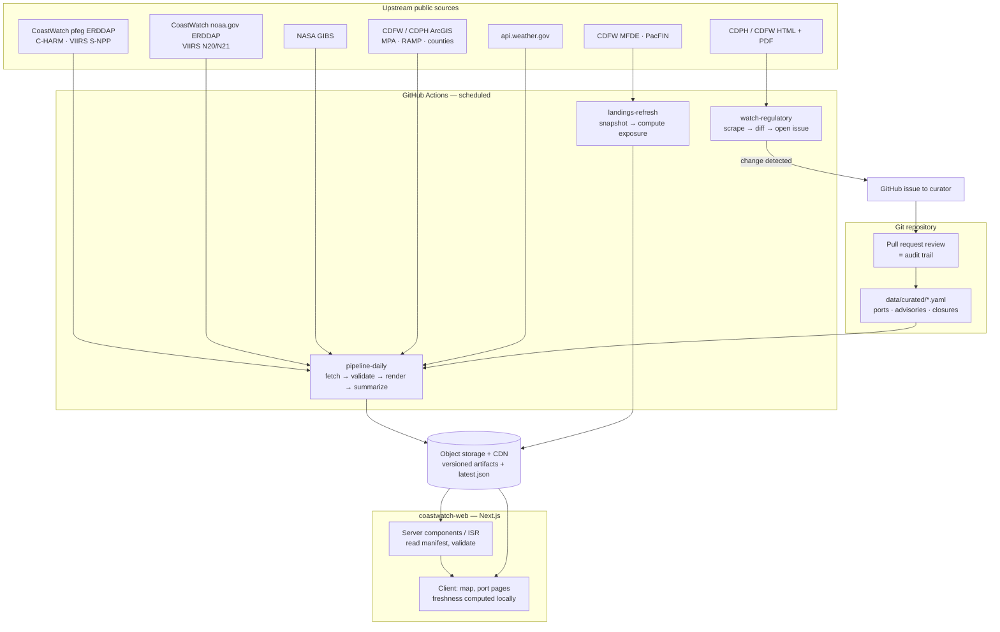

# 04 — Technical architecture

## 1. Design decisions (summary)

| # | Decision | Why | Rejected alternative |
|---|---|---|---|
| D1 | **Static-first, precompute everything.** A scheduled Python pipeline produces versioned, validated artifacts (images, value grids, GeoJSON, JSON summaries) and a manifest. The web app reads artifacts; it never calls upstream agencies at request time | Upstream servers are slow and flaky (ERDDAP 502/503, GIBS 500s, bot blocks). Precomputation isolates users from upstream failures, makes provenance exact, and costs ~$0 | Live proxying of ERDDAP/WMS per request; a tile server; a database-backed API |
| D2 | **Extend `coastwatch-web/`** (Next.js App Router + TypeScript + Tailwind) | Small, clean, type-checks; no need to rebuild | Rewrite; keep Streamlit |
| D3 | **No database in the MVP.** Curated official records live as YAML in git, reviewed via pull requests | PR history *is* the audit log ("who verified what, when, from which source URL"); zero infrastructure | Postgres/Supabase from day one |
| D4 | **Freshness is computed in the browser** from timestamps in the artifacts, not baked in by the pipeline | If the pipeline dies entirely, the UI still degrades correctly to "stale" instead of showing old data as current | Pipeline writes `is_current` flags |
| D5 | **One normalized schema family, Python as source of truth** (Pydantic → JSON Schema → generated TS types + runtime validation) | The producer and consumer cannot drift; invalid artifacts are rejected before publish and again on load | Hand-written TS types |
| D6 | **Product classes are separate namespaces** (`official/`, `observation/`, `forecast/`, `experimental/`, `history/`) in storage, schema, and UI | Enforces `05-science-and-safety.md` R1–R16 structurally, not just by convention | One flat layer list |
| D7 | **Render our own raster overlays, reprojected to EPSG:3857** | C-HARM nowcast has no WMS; ERDDAP WMS is slow; equirectangular images placed by corners are misplaced by up to ~18 km over 32–42°N | ERDDAP WMS tiles; unreprojected PNG overlays |
| D8 | **Switch map library to MapLibre GL** via `react-map-gl/maplibre` (same component API) with an open, keyless basemap | Removes token, metered map loads, and proprietary licensing; enables offline caching | Stay on Mapbox (acceptable fallback if basemap quality is insufficient) |
| D9 | **Experimental ML inference is an offline batch job** writing to `experimental/` | Web requests never load PyTorch; the model can be absent without affecting anything else | Inference API |

---

## 2. System overview



---

## 3. Repository layout

Research code is untouched. New top-level directories are `pipeline/`, `data/curated/`, `schemas/`.

```
habs-forecast/
├── coastwatch-web/                     # Next.js app (extended)
│   ├── src/app/
│   │   ├── layout.tsx                  # theme, fonts, status bar, footer
│   │   ├── page.tsx                    # Live Ocean Map
│   │   ├── ports/page.tsx              # port index
│   │   ├── ports/[portId]/page.tsx     # My Coast (static params from ports index)
│   │   ├── bloom/page.tsx              # explainer (MVP), intelligence (P2)
│   │   ├── fisheries/page.tsx          # P2
│   │   ├── data/page.tsx               # source freshness status
│   │   └── about/page.tsx
│   ├── src/components/
│   │   ├── map/        CoastMap, LayerRegistry, LayerToggle, Legend, Inspector, PortMarkers
│   │   ├── status/     OfficialStatusCard, StatusChip, NotVerifiedNotice, Hotlines
│   │   ├── port/       PortHeader, ForecastSummaryCard, ObservationCard, WeatherCard, ExposureCard, SourcesTable
│   │   ├── charts/     SpeciesMixBar, Sparkline, CoastalStrip (P2)
│   │   ├── provenance/ SourcePill, FreshnessDot, ProductClassBadge
│   │   └── ui/         Sheet, Tabs, Skeleton, EmptyState
│   ├── src/lib/
│   │   ├── data/       manifest.ts (fetch + validate), artifacts.ts, grids.ts (decode value grids)
│   │   ├── freshness.ts            # SLA rules per source → current/stale/failed/not_covered
│   │   ├── hierarchy.ts            # official-status engine (R1–R4)
│   │   ├── format.ts               # Pacific time, units, probabilities
│   │   └── geo.ts                  # existing helpers
│   ├── src/content/en/*.ts         # all user-facing copy (i18n-ready)
│   ├── src/generated/schema.ts     # generated from schemas/*.json
│   └── tests/ (vitest unit) · e2e/ (playwright)
├── pipeline/                       # new Python package (uv, Python 3.11+)
│   ├── pyproject.toml
│   ├── coastwatch_pipeline/
│   │   ├── models.py               # Pydantic schemas (source of truth)
│   │   ├── sources/                # one module per source: charm, viirs, gibs, nws, mpa, ramp, counties, landings
│   │   ├── watch/                  # cdph_list, cdfw_health, cdfw_whale_safe, cdph_webmap (change alarms)
│   │   ├── process/                # reproject, render, grid_encode, nearshore_mask, port_summary, exposure
│   │   ├── validate/               # artifact checks (ranges, coverage, bbox, monotonic time)
│   │   ├── publish/                # storage client, manifest writer, last-known-good pointer
│   │   └── cli.py                  # `cwp run daily`, `cwp run landings`, `cwp watch`
│   └── tests/ (pytest; recorded upstream fixtures)
├── data/curated/                   # human-reviewed, PR-only
│   ├── ports.yaml                  # id, name, coords, CDFW port area, PacFIN group, NWS zone, nearshore polygon params
│   ├── advisories.yaml             # CDPH records
│   ├── closures.yaml               # CDFW records
│   └── species_sensitivity.yaml    # tiers + citations
├── schemas/                        # generated JSON Schema (committed)
├── .github/workflows/
│   ├── pipeline-daily.yml · watch-regulatory.yml · landings-refresh.yml · web-ci.yml
└── docs/coastwatch/
```

The `dashboard/` Streamlit app and its CI workflow are retired in M0 (moved to an `archive/` note, or deleted); useful mask code is ported into `pipeline/process/`.

---

## 4. Normalized schemas

All artifacts share a provenance envelope. Times are ISO-8601 UTC.

```ts
type ProductClass =
  | "official_regulatory" | "official_forecast" | "observation"
  | "experimental_model" | "historical_context";

type Provenance = {
  source_id: string;            // e.g. "charm", "viirs_chl", "cdfw_closures"
  source_name: string;          // "C-HARM v3.1 (NOAA CoastWatch West Coast)"
  source_url: string;           // dataset or page URL
  product_version?: string;     // "3.1"
  license: string;
  retrieved_at: string;
  pipeline_run_id: string;      // GitHub Actions run id
  pipeline_version: string;     // git sha
};

type Manifest = {
  schema_version: 1;
  generated_at: string;
  layers: LayerArtifact[];
  ports_index_url: string;
  official_records_url: string;
  exposure_url: string;
  source_status: SourceStatus[];
};

type SourceStatus = {
  source_id: string;
  product_class: ProductClass;
  last_success_at: string | null;
  last_attempt_at: string;
  last_error?: string;
  latest_valid_time: string | null;
  freshness_sla: { current_hours: number; stale_hours: number }; // UI computes state from these
};

type LayerArtifact = {
  layer_id: string;             // "charm_pn", "charm_pda", "charm_cda", "viirs_chl", "mpa", "ramp_zones"
  product_class: ProductClass;
  title: string;
  kind: "raster" | "vector";
  valid_time?: string;          // single-day products
  valid_start?: string; valid_end?: string;  // composites
  issued_at?: string;           // derived (C-HARM: nowcast valid + 1 d, flagged as derived)
  lead_days?: number;           // 0..3 for C-HARM
  resolution_m?: number;
  units?: string;               // "probability", "mg m-3"
  scale?: { type: "linear" | "log10"; min: number; max: number; palette_id: string };
  threshold_text?: string;      // "P(Pseudo-nitzschia > 10,000 cells/L)"
  coverage?: { valid_fraction: number; domain: "ca_nearshore" };
  image?: { url: string; bounds_3857: [number, number, number, number]; corners_lnglat: [[number,number],[number,number],[number,number],[number,number]] };
  grid?: { url: string; width: number; height: number; transform: number[]; encoding: "uint16_png"; scale_factor: number; add_offset: number; nodata: number };
  geojson_url?: string;
  caveats: string[];            // e.g. "Toxin probabilities not provided within ~3–6 km of shore"
  provenance: Provenance;
};

type OfficialRecord = {
  id: string;                   // "cdfw-2026-anchovy-monterey"
  agency: "CDFW" | "CDPH" | "OEHHA" | "NOAA";
  action: "closure" | "delay" | "advisory" | "quarantine" | "take_restriction"
        | "evisceration_order" | "trap_prohibition" | "depth_constraint" | "lifted";
  toxin?: "domoic_acid" | "psp" | "other";
  species: string[];            // canonical species ids
  fishery?: "commercial" | "recreational" | "both";
  area:
    | { type: "statewide" }
    | { type: "county"; counties: string[] }
    | { type: "lat_band"; lat_north: number; lat_south: number; description: string }
    | { type: "zone"; scheme: "ramp"; zones: number[] }
    | { type: "polygon_ref"; ref: string };
  summary_verbatim: string;     // quoted from the source
  effective_at: string | null;
  lifted_at: string | null;
  source_urls: string[];        // press release, declaration PDF, OEHHA memo
  last_verified_by: string;     // curator handle
  last_verified_at: string;
};

type PortSummary = {
  port_id: string;
  generated_at: string;
  official: { records: string[]; coverage: SourceStatus[] };   // ids into OfficialRecord
  forecast?: {                  // C-HARM in the port's nearshore area
    layer_id: string; valid_time: string; lead_days: number;
    area_fraction_over: { threshold: number; value: number };  // e.g. share of area with P ≥ 0.5
    median: number; p90: number; trend_7d?: "rising" | "steady" | "falling" | "insufficient_data";
    method_url: string;
  }[];
  observation?: { layer_id: string; valid_time: string; median_mg_m3: number; valid_fraction: number };
  weather?: { nws_zone: string; headline: string; hazards: string[]; issued_at: string };
  exposure_ref: string;         // CDFW port area id
};

type ExposureMetrics = {
  port_area_id: string;         // CDFW port area
  years: number[];              // e.g. 2021–2025
  dollars_basis: "real_2025_usd_cpi_u";
  tier1_value_mean: number | null;  tier1_share: number | null;
  tier2_value_mean: number | null;  tier2_share: number | null;
  by_species: { species_id: string; tier: 1 | 2; value_mean: number | null; suppressed_years: number }[];
  is_lower_bound: boolean;      // true if any suppressed cells
  caveats: string[];
  provenance: Provenance[];
};
```

---

## 5. Pipeline design

### 5.1 Jobs

| Job | Schedule | Steps | Runtime target |
|---|---|---|---|
| `pipeline-daily` | 4× daily (C-HARM posts once a day at an unknown time; VIIRS ~11 h after overpass) | For each source independently: probe latest time → if new, fetch CA subset → validate → reproject → render image + value grid → write artifact. Then recompute port summaries and manifest. Publish only validated artifacts; advance `latest.json` atomically | < 10 min |
| `watch-regulatory` | Every 6 h (in crab season), daily otherwise | Fetch CDPH list, CDFW Health Advisories, Whale-Safe page, CDPH web-map JSON, RSS → normalize (strip comments, zero-width chars) → hash main content → on diff, open/append a GitHub issue with the diff and links. **Never writes official status** | < 2 min |
| `landings-refresh` | Monthly probe; real update annually | Snapshot MFDE responses to storage (raw), compute exposure metrics with CPI, open PR with diff summary | < 5 min |
| `geometry-refresh` | Weekly | MPA ds582, RAMP ds3120, county polygons → compare count/edit date/geometry hash → on change open a PR | < 2 min |
| `web-ci` | On PR | Typecheck, lint, unit, schema validation of fixtures, Playwright smoke, link checker | — |

### 5.2 Processing details

- **Domain:** CA nearshore analysis domain = ocean within 50 km of the coastline, 32.4–42.1°N (exact mask built once from Natural Earth / CDFW coastline, versioned).
- **Reprojection:** `rioxarray`/`rasterio` warp to EPSG:3857 at a fixed grid per product (C-HARM ~3 km, VIIRS ~750 m); bounds stored with the artifact.
- **Value grids:** quantized uint16 PNG (lossless, small, decodable in the browser via canvas) with scale/offset/nodata in the artifact; used by the inspector and by client-side summaries.
- **Rendering:** fixed palettes and fixed ranges per product (never data-driven percentiles; R6). Nodata → transparent; cloud gaps → hatch pattern drawn client-side from the grid's nodata mask.
- **Port nearshore areas:** per port, polygon = analysis domain ∩ circle (default 30 km) around the port entrance, adjustable per port in `ports.yaml`, reviewed; C-HARM toxin variables use nearest valid offshore pixels where the mask excludes nearshore cells (caveat recorded).
- **C-HARM trend:** compare nowcast area-fraction over the last 7 available days with a minimum of 4 runs; else `insufficient_data`.
- **Validation gates:** value ranges (probabilities 0–1, chl 0.01–100), valid-fraction floor, expected bbox, valid_time newer than previous, file sizes, GeoJSON feature-count deltas (> 10% change → review). Failure leaves last-known-good in place and records `last_error`.

### 5.3 Storage

Object storage with public read behind a CDN. Recommended: **Cloudflare R2** (free egress, free tier covers this scale). Alternative: GitHub Pages branch or Vercel Blob.

```
/v1/latest.json
/v1/status.json
/v1/layers/{layer_id}/{valid_date}/lead{n}.{image.png|grid.png|json}
/v1/vector/{layer_id}/{content_hash}.geojson
/v1/official/records-{sha}.json
/v1/ports/index.json
/v1/ports/{port_id}.json
/v1/history/exposure-{years}.json
/v1/raw/landings/mfde/{year}/... (raw snapshots, not served to UI)
/v1/experimental/{model_id}/...   (P3)
```

Retention: 90 days of daily layers (enables P2 timeline); raw landings forever.

---

## 6. Provenance, freshness, and failure handling

| Failure | Behavior |
|---|---|
| One upstream source down | Its job step fails; other sources publish normally; `status.json` records the error; UI shows that layer as stale with "last updated …" |
| Validation fails | Artifact not published; last-known-good stays; GitHub issue opened |
| Whole pipeline stops | Artifacts age; the browser computes `stale`/`failed` from `latest_valid_time` + SLA; status bar turns amber/grey |
| Regulatory curation lags | `last_verified_at` older than SLA → port status card shows "Status not verified — check CDFW/CDPH" + hotlines (R2) |
| Manifest unreachable | App shows an explicit offline/error state with official links and hotlines (cached in the service worker in P2) |

Every rendered number carries its `Provenance`; the port page ends with a sources table generated from the same objects.

---

## 7. Web application

- **Rendering:** port pages and the map shell are server components with ISR (`revalidate` ≈ 10 min) reading `latest.json`; dynamic layer artifacts are fetched client-side from the CDN. Ports index drives `generateStaticParams`.
- **State:** URL is the state (`?layer=charm_pda&lead=1&port=moss-landing`) for shareable links; small React context for theme and favorite port (localStorage, try/catch).
- **Map:** `react-map-gl/maplibre`; layers declared in a registry keyed by `layer_id` with `product_class` → badge, legend, default visibility, z-order (official vector overlays always on top).
- **Performance budget:** JS < 250 KB gzipped on port pages (map lazy-loaded); images < 1 MB per layer; LCP < 2.5 s on 4G.
- **Accessibility & i18n:** copy in `src/content/en`; screen-reader summaries per layer generated from artifact metadata.
- **Next.js version:** decide in M0 whether to move to Next 16 before feature work.

---

## 8. Future model inference (P3)

```
pipeline/experimental/
  build_inputs.py   # VIIRS 8-day composites + CMEMS anfc + GFS/ERA5T → 28-channel stack on model grid
  infer.py          # loads checkpoint + model_card.json (channel order, norm stats) → ensemble/MC-dropout mean + spread
  publish.py        # writes /v1/experimental/{model_id}/{valid_date}/... with ProductClass "experimental_model"
```

Preconditions (see `06-development-plan.md` §2, P3): retrained on VIIRS-era inputs with `nflh` removed/replaced; normalization stats and channel order persisted with the checkpoint; held-out skill vs persistence on ≥ 2022 data; model card. Runs weekly on CPU in Actions (Copernicus credentials as a repository secret). The website treats a missing experimental artifact as normal.

---

## 9. Cost and dependencies

| Item | Choice | Cost |
|---|---|---|
| Hosting (web) | Vercel Hobby or Cloudflare Pages (confirm terms for a public non-commercial project) | $0 |
| Artifacts | Cloudflare R2 + CDN | $0 at expected scale |
| Scheduler | GitHub Actions (public repo) | $0 |
| Basemap | Open keyless basemap (e.g., OpenFreeMap or self-hosted Protomaps PMTiles on R2) | $0 |
| Paid APIs | None | $0 |
| Accounts needed | R2 (or chosen storage); later: Copernicus Marine (free) for P3; email provider for P2 alerts | — |
