# 13 — Redesign phase P0: foundations

Status: **implemented on `feat/coastwatch-redesign-p0`, not merged or deployed.**

P0 implements the shared foundations of the approved CoastWatch design reset: design spec, prototypes and
plan in PR #7 (`docs/coastwatch/design-reset/` on `design/coastwatch-design-reset`), approved 2026-10-09.
P0 changes the frame every page sits in. The page layouts themselves change in P1 (map), P2 (Bloom) and
P3 (Fisheries).

## What is implemented

| Plan item | Implemented |
|---|---|
| P0.1 Tokens | `src/app/globals.css` now has two themes. The light **paper** theme (`:root`) is the default for reading pages. The **dark sea** theme (`.theme-dark`) keeps today's map tokens exactly, so map components render as before. Components use the same semantic `--cw-*` names in both. Added: the navy frame, the official (amber), model (violet), measured (teal) and historical families, chart series tokens, and the forecast display classes `--cw-p0…p9`. |
| | `src/lib/palette.ts`: `cw-probability-classes-v1` (10 display classes, not risk levels) and `forecastClass()`. The map adopts them in P1. |
| P0.2 Fonts | Newsreader (display), IBM Plex Sans (interface), IBM Plex Mono (data) via `next/font/google`. They are self-hosted at build time, with no runtime request to Google. Tabular lining figures are on globally. Geist removed. |
| P0.3 Shell | `AppShell`: a navy masthead (brand, **Ocean Map · Bloom Intelligence · Fisheries**, the official pill, Data status). "My Coast — UPCOMING" is removed. A mobile **tab bar** below 768 px (Map, Blooms, Fisheries, **Notices** with a count badge). The `app` variant puts the map on the dark theme; `page` variants are on paper. |
| P0.4 Official family | `OfficialProvider`, `OfficialPill` and `OfficialDrawer` (a modal dialog with focus moved in, focus trapped, Escape to close and focus returned to the opener; mounted only while open, so notice ids exist once). Every page now passes its official dataset and source status to the shell. The pill shows the active count and the computed verification state ("Not verified" today). The drawer lists every active notice by agency with the agency wording, statements, the "missing does not mean open" line, links and hotlines. With no data, it still routes to CDFW and CDPH. The notice card, agency chip and verification styles use the official tokens, so they read on paper and on the dark map. |
| P0.5 Status primitives | `FreshnessBadge`: historical is now a neutral open ring, as in the spec, rather than an orange clock. `ProductClassBadge`: semantic colours (model violet, measured teal, official amber, historical slate). New `AgencyChip`. `Segmented` restyled as the spec's segmented control. |

Hard-coded dark-only colours were moved to tokens so the reading pages are legible on paper:
- the official amber in `Official.tsx` and the Bloom official section;
- the Bloom series colours;
- the Fisheries bar colour and official text.

The Bloom station map keeps the dark sea, with its key, inside a dark card.

**Not in P0 (deliberately):** `OfficialStrip`, `OfficialBlock` and `OfficialSection` are built with the pages
that use them (P1–P3), so P0 adds no unused components. `TabList` was dropped: design revision 2 replaced
the Bloom measurement tabs with selector cards.

**Token adjustments found by the new contrast test:** current green `#1d7f53 → #1a7a4f`, stale amber
`#9a6a00 → #8a5f00`, neutral `#6b7480 → #5f6874`, so every state colour clears 4.5:1 on paper as well as
on white. On the dark map, the model badge text uses `--cw-model-ink` (`#c3aef3`, the spec's model on
navy) instead of the pink forecast colour, which failed AA there.

## What did not change

- The `lib/` helpers, data loading, schema, Ajv validation, freshness rules, observation and fisheries
  computations, and the pipeline are untouched.
- No page layout or scientific content changed beyond the shell and colours. Every existing
  `data-testid` is kept.
- Nothing is merged or deployed.

## Tests

| Suite | Result |
|---|---|
| `vitest` (unit) | **73 passed** (68 before, plus 5 in `tests/unit/design.test.ts`: tokens equal the palette module; classes rise monotonically in lightness; 10-point class boundaries; semantic colours distinct in both themes; every text and state token ≥ 4.5:1 on paper and white). The navigation safety test now asserts that only built experiences are navigation. |
| Playwright e2e (fixture build) | **56 passed** (42 before, minus the old "My Coast is upcoming" test, plus its replacement and 14 in `tests/e2e/shell.spec.ts`): the pill count and state and the drawer with every notice on all four pages; Escape and focus return; the no-data drawer; fonts; paper versus dark themes; the mobile tab bar with Notices and no overflow on all four pages; the map sheet above the tab bar; axe on the open drawer and on mobile map and Bloom. The existing axe checks pass on all pages. |
| `tsc --noEmit`, `eslint` | clean |

## Screenshots

Captured with `npm run shots` (`scripts/shoot.mjs`) from the production build against the **published
GitHub Pages dataset** (2026-10-09), in [redesign-p0/screenshots/](redesign-p0/screenshots/):

| | Desktop 1440 | Laptop 1280 | Mobile 390 |
|---|---|---|---|
| Ocean Map | 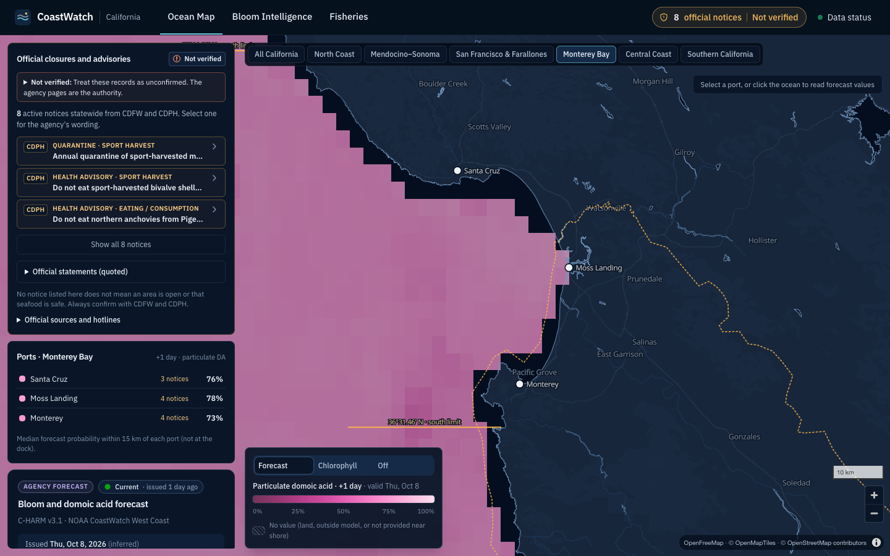 | 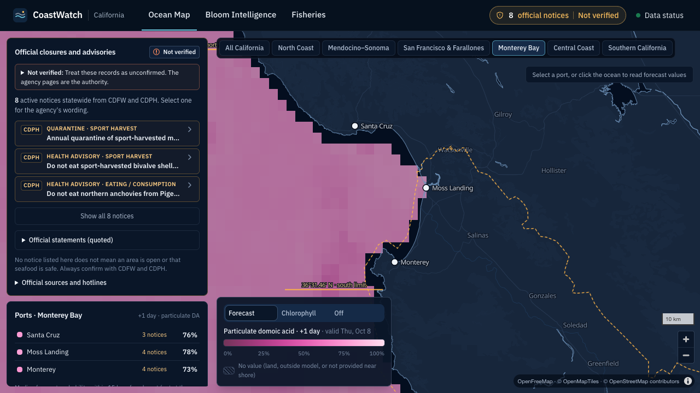 | 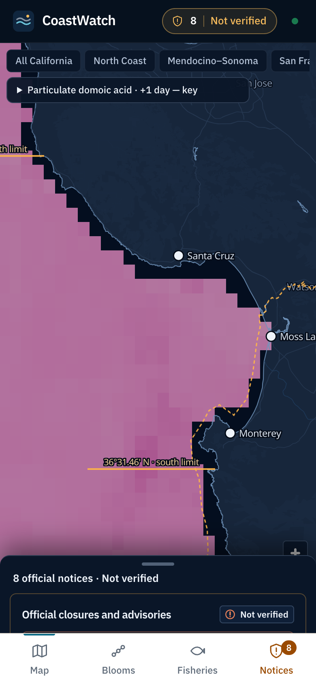 |
| Bloom Intelligence (full page) | 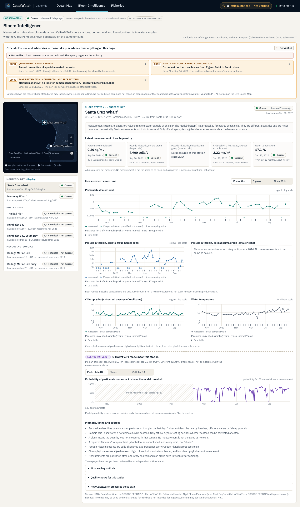 | 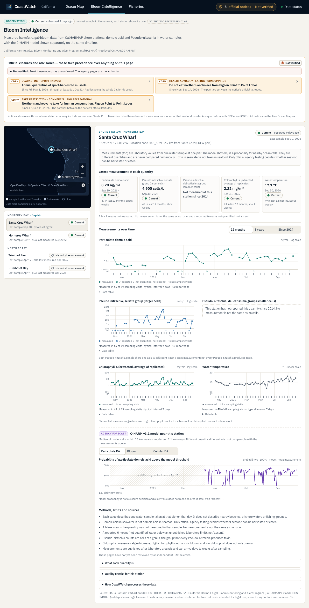 | 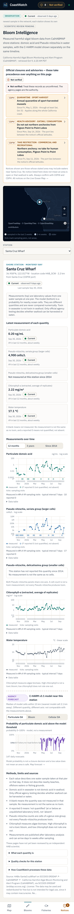 |
| Fisheries (full page) | 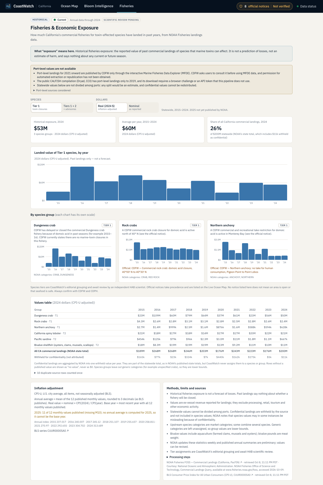 | 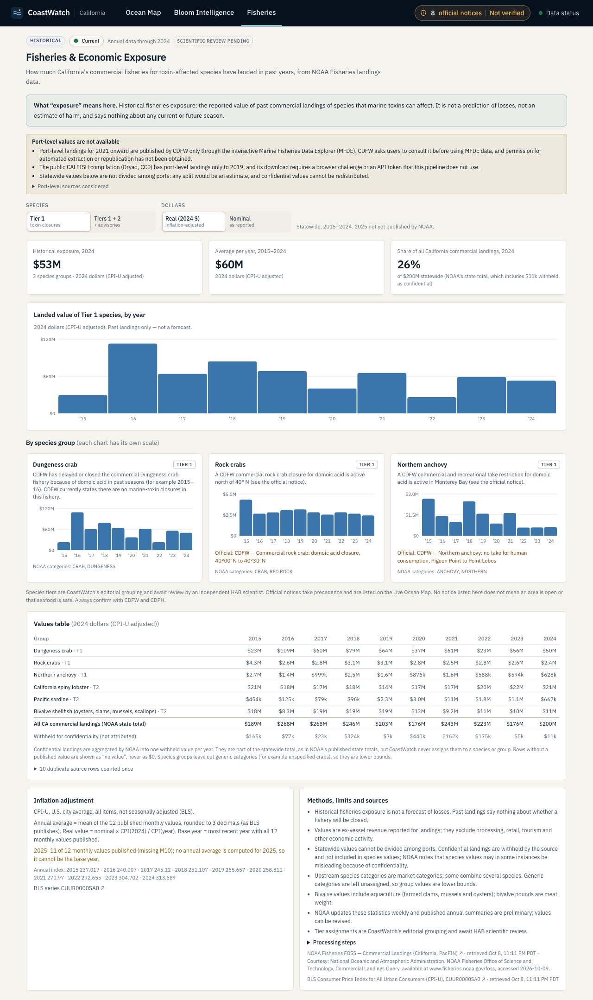 | 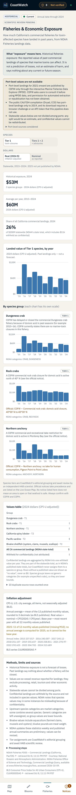 |
| Data status | 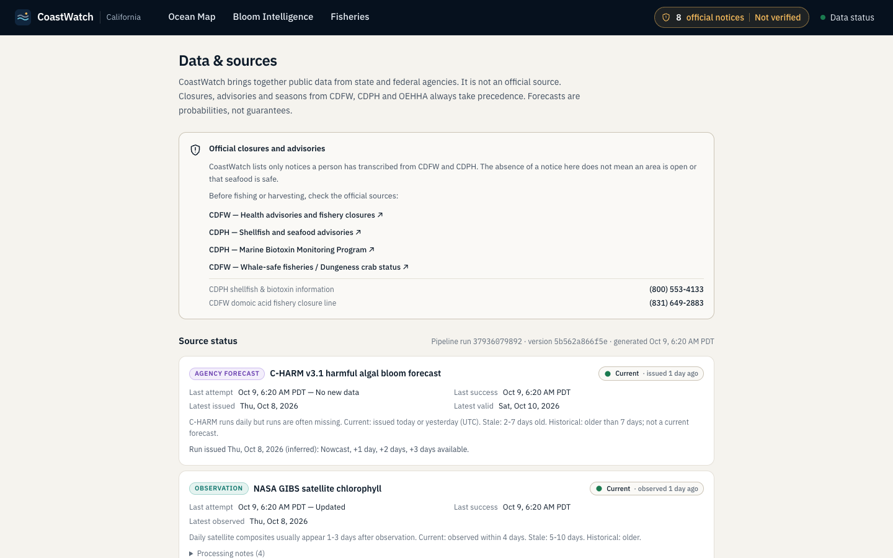 | | 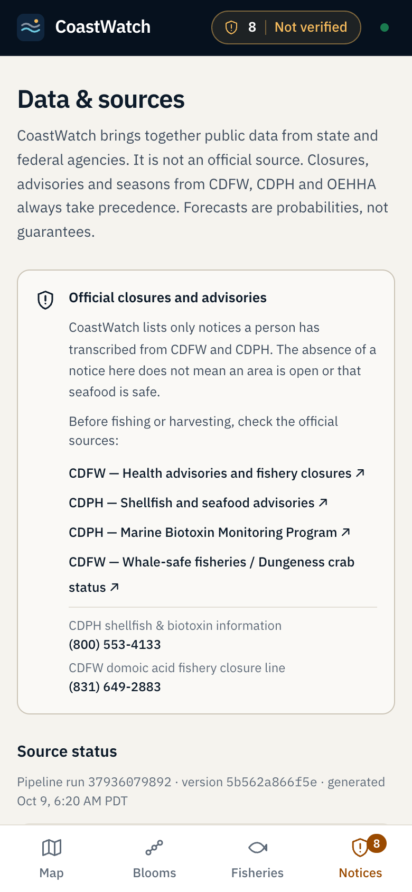 |
| Official drawer | 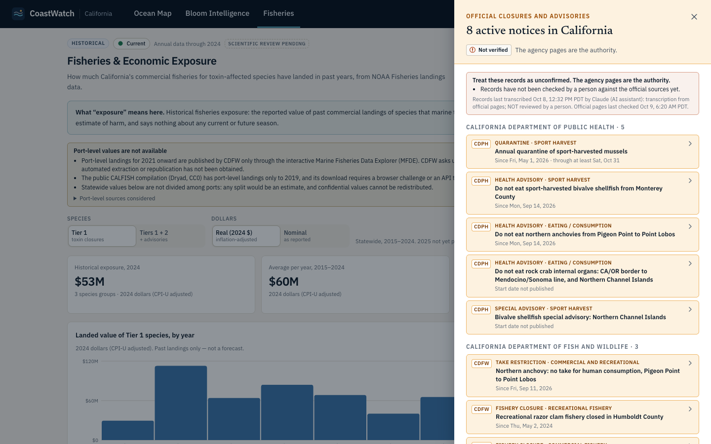 | | 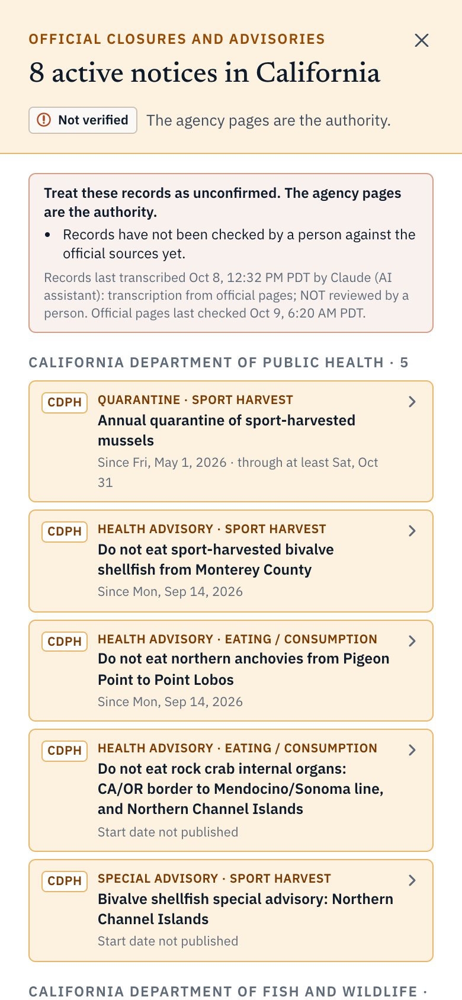 |

## Known limitations

- The page bodies are still the M3 layouts, now on paper or dark tokens. Some M3 type sizes (10.5–13 px)
  are below the spec's minimums until each page is rebuilt.
- On the map page (dark), the desktop left rail and the drawer both list notices. The rail is replaced
  by the compact navigation card in P1.
- The drawer's notice cards keep the M2 expand-on-click design; the spec's notice article layout comes
  with the official family in P1.

## Next phase: P1, Ocean Map

1. **Palette pipeline PR (gated):** add `cw-probability-classes-v1` to `pipeline/coastwatch_pipeline/process/palette.py` and make it the C-HARM palette. Only PNG colouring changes, then a staging run.
2. **Navigation card, dock, readout and inspector:**
   - a `NavCard` (official summary row, port search, regions → ports → breadcrumb);
   - a `ForecastDock` (quantity, day steps, stepped legend with "display steps, not risk levels" and the hatched no-value swatch);
   - a pointer/tap `ValueReadout` built on the existing `lib/grid.ts` `sample()`;
   - a `PortInspector` that exists only while a port is selected.
3. **Basemap:** lighter land, the coastline above the forecast, an opaque raster with no-value hatching, and hand-set region views.
4. **Mobile:** a `BottomSheet` with a floating place button and a compact legend.
5. **Exit tests:**
   - the existing map e2e tests;
   - official-first order in the inspector;
   - no inspector until a port is selected;
   - no dock/inspector overlap at 1280 px;
   - legend swatches equal the palette.
