# CoastWatch design reset

A complete redesign of the CoastWatch frontend, delivered as **specification + working prototypes +
screenshots** for review. Nothing in `coastwatch-web/` or `pipeline/` was changed. Nothing is merged or
deployed.

| Document | Contents |
|---|---|
| [design-spec.md](design-spec.md) | Problems → answers, visual principles, typography, colour (with measured contrast), page specs, navigation and layout, component hierarchy, data-vis conventions, scientific and regulatory rules, mobile interaction, prototype gaps |
| [implementation-plan.md](implementation-plan.md) | Prioritised phases P0–P4, test strategy, effort, decisions needed, and one unrelated data finding |
| `prototype/` | Static HTML/CSS/JS prototypes of the three pages (desktop and mobile in one responsive build) |
| `screenshots/` | 1440 × 900, 1280 × 720 and 390 × 844 captures |
| `scripts/` | Reproducible data snapshot, raster rendering and screenshot capture |

## Real data, not mock-ups

Every number, date, label, notice and review state in the prototypes comes from the **production GitHub
Pages dataset, run 37880564301** (generated 2026-10-09 03:43 UTC). `scripts/build_data.py` copies the
published JSON into `prototype/data/coastwatch-data.js`, dropping only fields the prototypes don't display.
`scripts/render_rasters.py` re-colours the published C-HARM **u16 value grids**, the same numbers the live
map uses, with the proposed palette. Reprojection and nearest-neighbour sampling follow the pipeline
exactly. The prototypes treat the snapshot time as "now", so ages match the run.

No measurements, economic values, forecast skill, testimonials or advisory statuses were invented. The
notices remain **Not verified** (`pending_human_review`), and pages that await HAB scientist review still
say so.

## Viewing the prototypes

```bash
cd docs/coastwatch/design-reset
python3 -m http.server 8765 -d prototype   # then open http://localhost:8765/
```

Narrow the window below 720 px for the mobile layouts. Useful URLs: `map.html?region=monterey_bay&port=593`,
`bloom.html?station=HABs-MontereyWharf`, `bloom.html?station=HABs-TrinidadPier`,
`fisheries.html?group=bivalves`.

Regenerate everything from the current production data:

```bash
scripts/fetch_pages.sh /tmp/cw-pages      # downloads Pages v1, re-renders rasters, rebuilds data
node scripts/shoot.mjs                    # needs coastwatch-web/node_modules (Playwright)
# if Playwright's pinned browser isn't installed: CW_CHROME=/path/to/chrome node scripts/shoot.mjs
```

## Screenshots

### Ocean Map

| | Desktop 1440 | Laptop 1280 | Mobile 390 |
|---|---|---|---|
| Statewide | 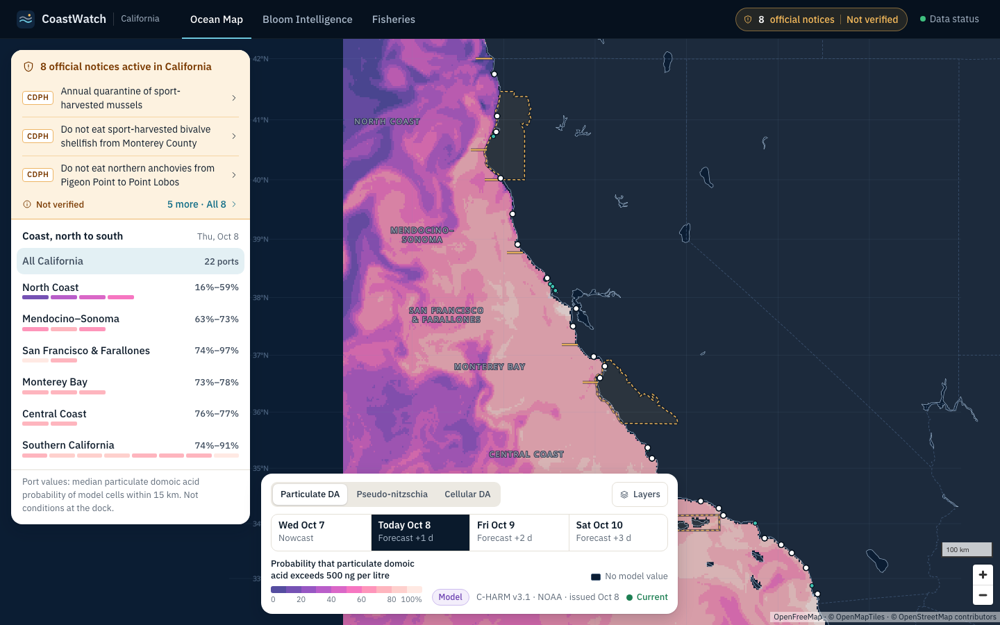 | 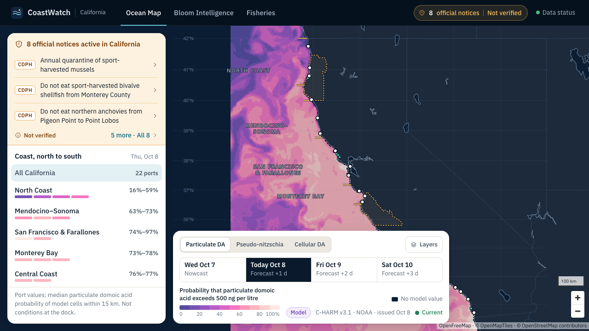 | 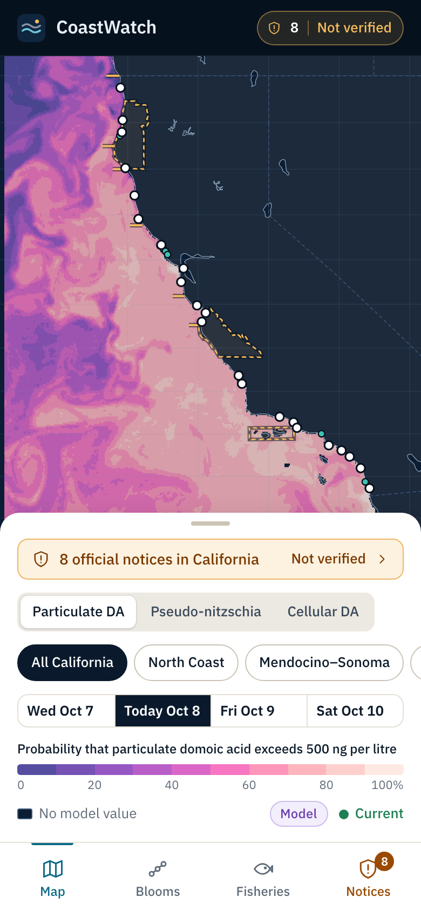 |
| Santa Cruz selected | 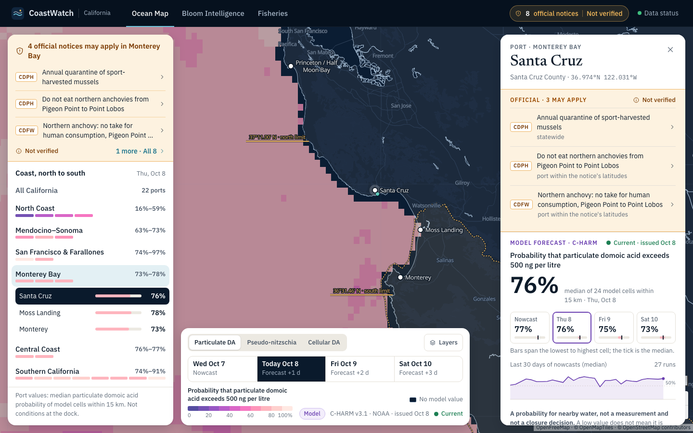 | 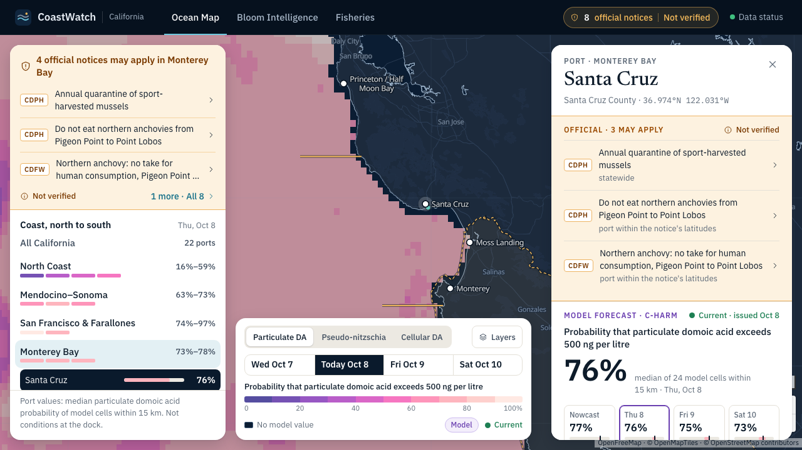 | 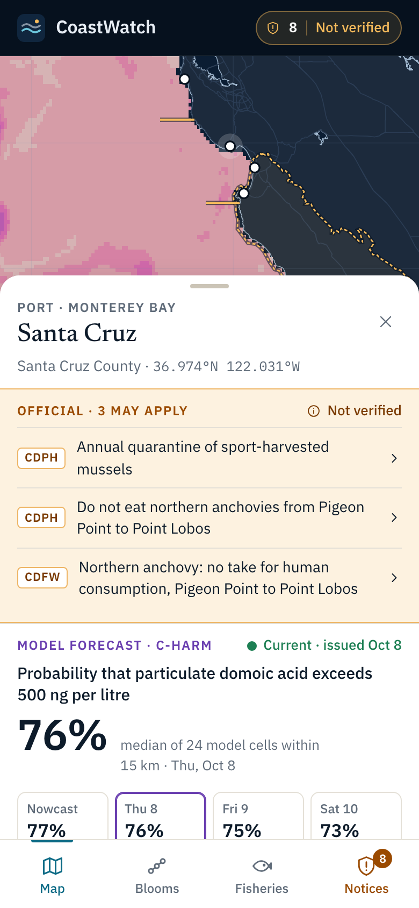 |
| Official drawer | 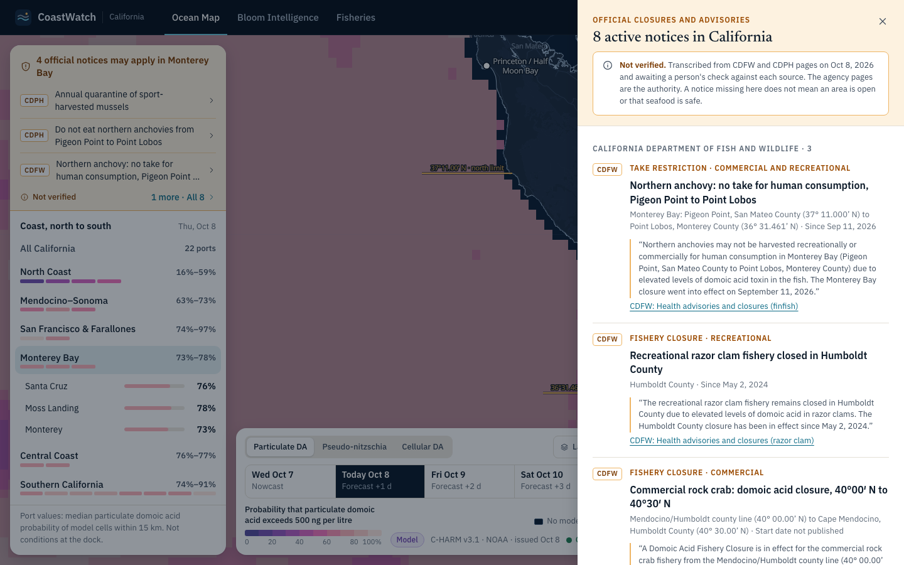 | | 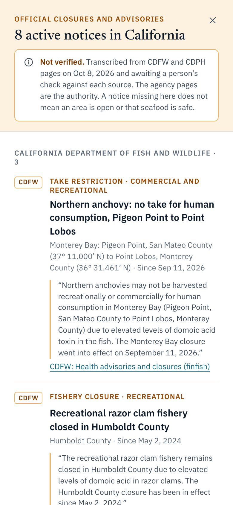 |

### Bloom Intelligence

| | Desktop 1440 | Laptop 1280 | Mobile 390 |
|---|---|---|---|
| Santa Cruz Wharf | 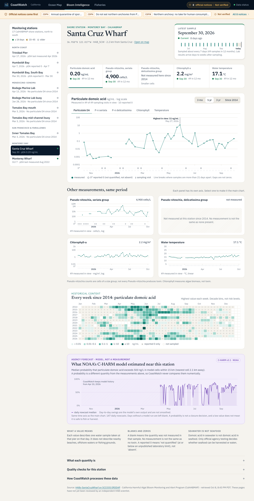 | 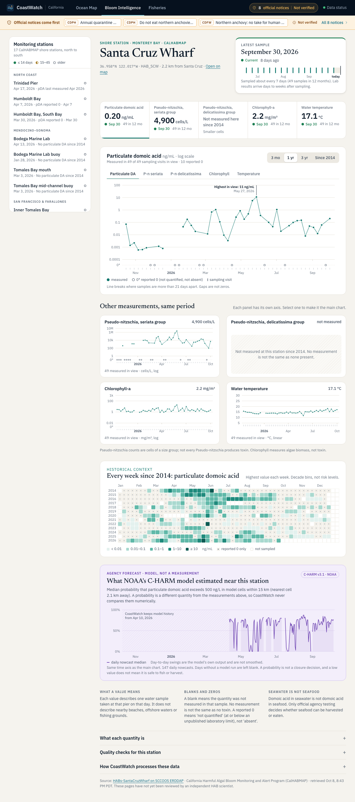 | 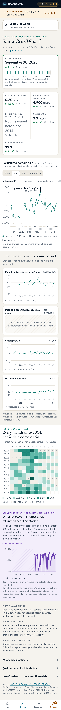 |
| Monterey Wharf (pDA last measured 2022) | 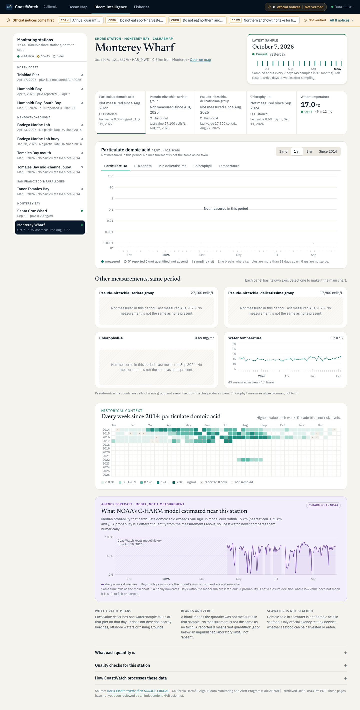 | | 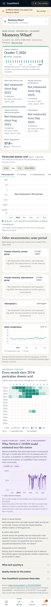 |
| Trinidad Pier (historical station) | 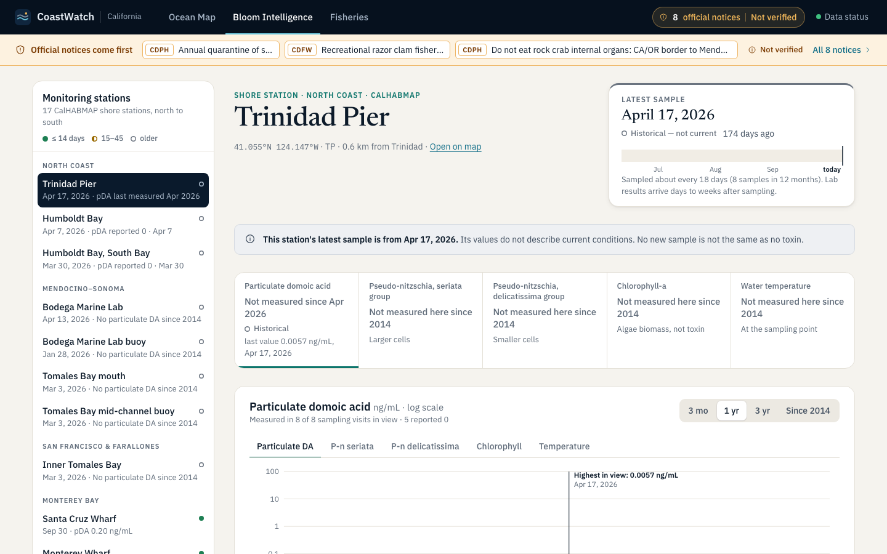 | | |

### Fisheries & Economic Exposure

| | Desktop 1440 | Laptop 1280 | Mobile 390 |
|---|---|---|---|
| Default (Tier 1, 2024 $) | 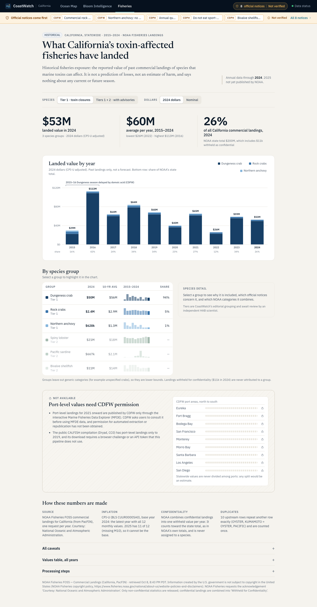 | 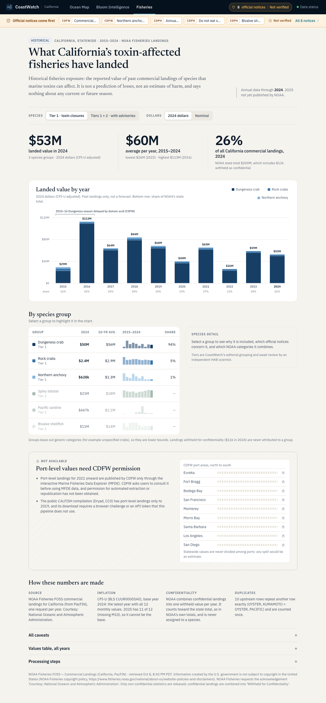 | 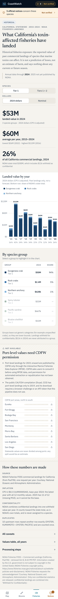 |
| Dungeness crab selected | 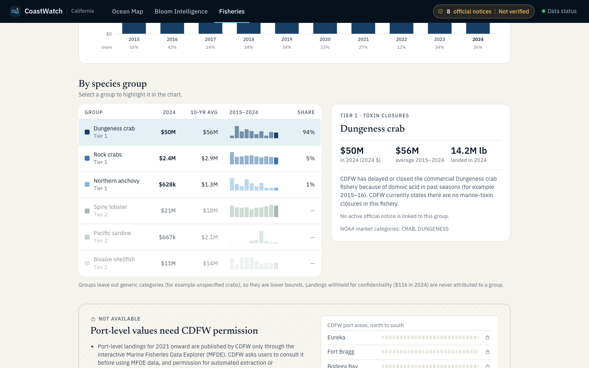 | | 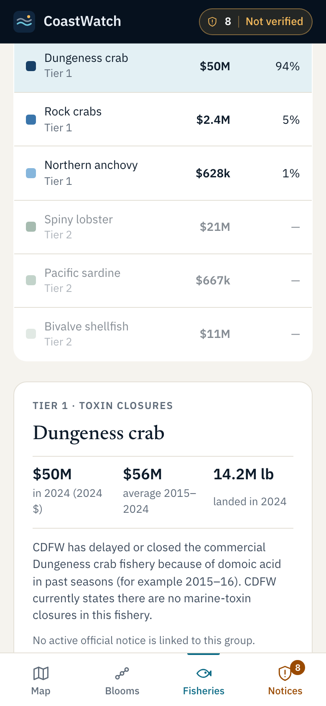 |

Bloom and Fisheries captures are full-page. Map captures are the viewport.

## Self-review: what changed between iterations

I reviewed each capture and iterated. The changes that mattered:

- **Map framing.** The first pass centred the dock and fitted California under every panel, so the coast
  rendered small and Southern California sat under the dock. The coast now fits between the measured
  panel edges, the dock moved over open ocean, and region views add context so model cells don't read as
  large blocks.
- **Forecast legibility at harbour zoom.** At port zoom the 3 km cells became large opaque blocks.
  Raster opacity now falls with zoom, while resampling stays nearest-neighbour.
- **Ramp labels collided** ("0%10"). Labels now sit on class boundaries at 20-point steps.
- **Mobile overflow.** The Bloom main grid track grew to its content (565 px on a 390 px screen), and the
  Fisheries segmented controls overflowed. Both fixed and checked by measuring `scrollWidth`.
- **Old values looked current.** At Monterey Wharf a 2022 particulate DA value appeared at headline size.
  It now reads "Not measured since Aug 2022", with the value in small text (§3.2 rule 5).
- **Wrong cadence text.** "No regular sampling" appeared for a station sampled weekly, because cadence was
  taken from pDA only. It now uses the most frequently measured quantity.
- **Model track dips.** I checked whether Santa Cruz's drops toward 0 % came from partial-coverage runs.
  They don't (n = 26 of 26 cells), so they are real model output. The chart keeps them and says it does
  not smooth them. Partial runs, where they exist, become open markers.
- **Small details:** two-significant-figure values with trailing zeros (0.20), units set smaller so
  values don't wrap at 1280, the tab bar pinned to the end of full-page captures, and a dock that no
  longer runs under the inspector at 1280.

## Remaining limitations

- The prototypes depend on OpenFreeMap tiles and Google Fonts at view time, as production does for tiles.
- They are design references, not production code: see design-spec §8 for unimplemented interactions.
- Contrast was verified numerically for the tokens. A full assistive-technology pass belongs to P4.
- The forecast palette requires a small pipeline change to ship (implementation plan, P1.1).
