# 4. Representative high-resolution map experiments

All images come from the [map lab](lab/index.html), built from the data fetched on 2026-10-09:
- `scripts/render_lab.py` draws the layers;
- `scripts/shoot_lab.mjs` takes the screenshots at 1440 × 900.

To open it, run `python3 -m http.server 8767 -d docs/coastwatch/forecast-upgrade/lab` and open http://localhost:8767/.

**Rendering rules followed**
- **Nearest-neighbour reprojection** for every layer, so a screen pixel shows one real cell.
- **Opaque rasters over a hatched sea.** Hatching only shows where a layer has no value, and the legend colours match the map exactly.
- **Coastline drawn above all data**, with land lighter than the sea.
- **Native spacing printed** on every layer, in the list and in the legend.
- **Day buttons show coverage:** each satellite day has a bar for how much of the view had a value.

## Monterey Bay, one region, five sources

| C-HARM pDA, native 3 km cells | C-HARM, display interpolation (same data) |
|---|---|
| 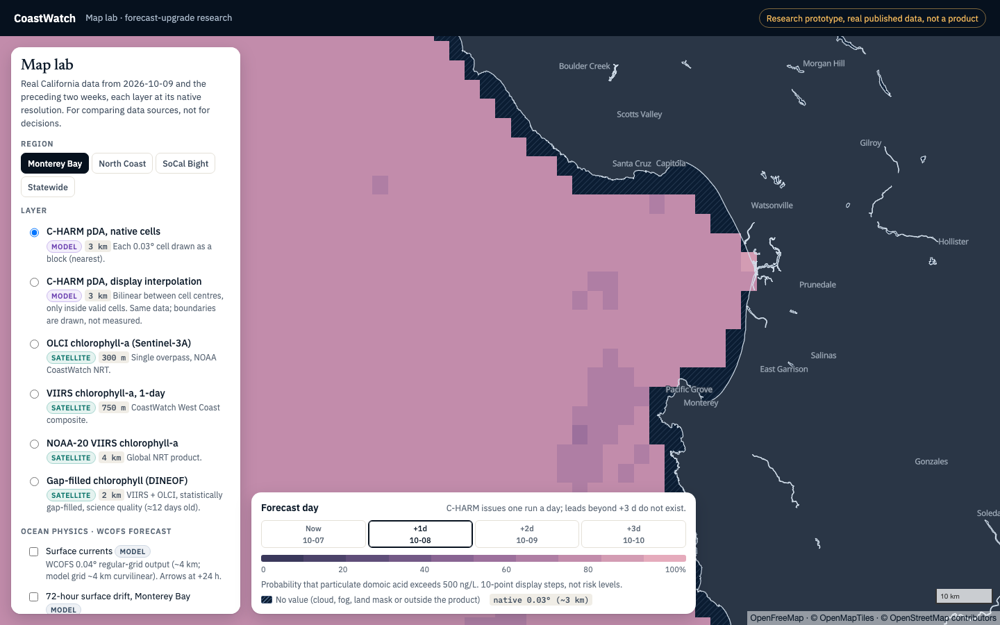 |  |
| **OLCI 300 m, clear day 2026-09-24** | **OLCI 300 m, newest overpass 2026-10-07 (fog)** |
| 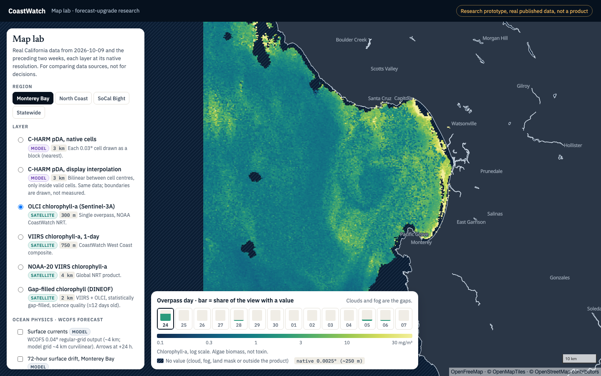 | 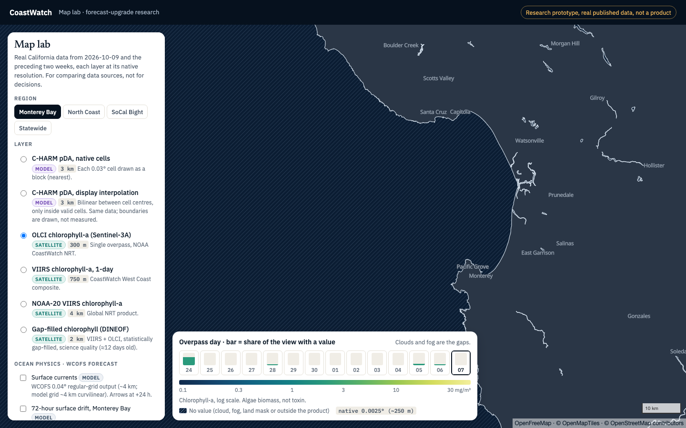 |
| VIIRS 750 m, 2026-09-25 | VIIRS 4 km, 2026-09-25 |
| 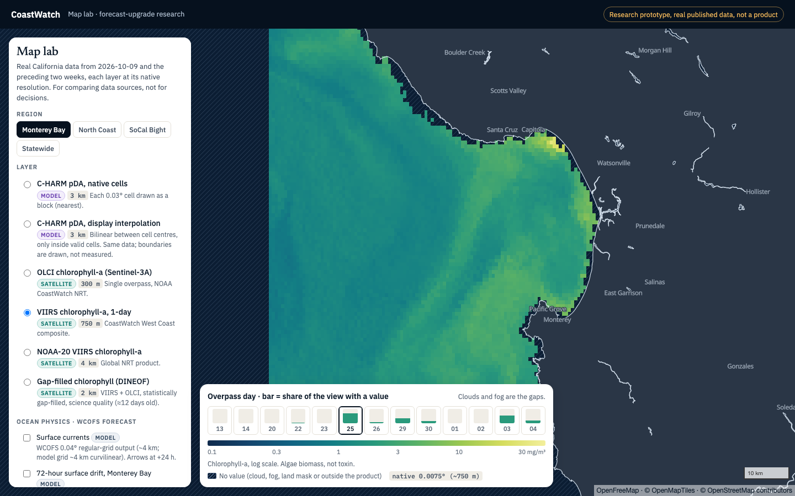 | 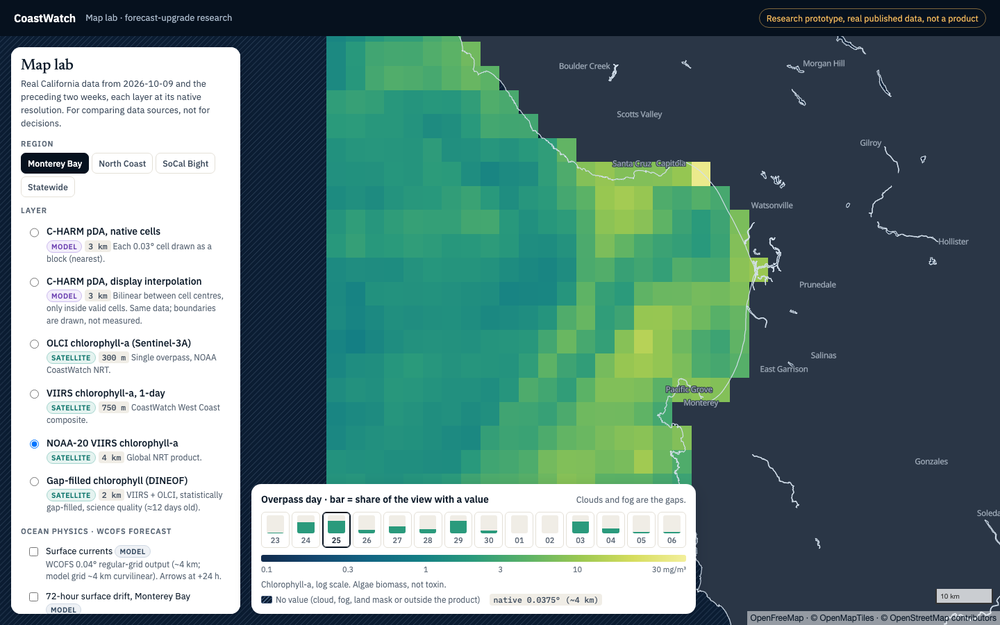 |
| DINEOF gap-filled 2 km, 2026-09-27 | **OLCI 300 m + WCOFS surface currents + 72-hour drift** |
| 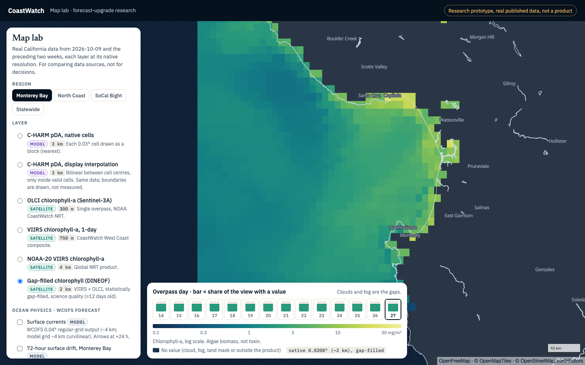 | 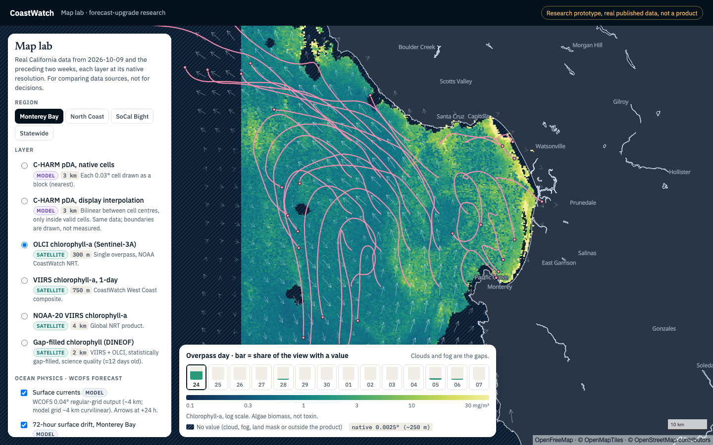 |

What the comparison shows:
- **C-HARM, native cells.** Monterey Bay is one or two probability classes, drawn as 3 km blocks, with a 1–5 km hatched strip of no value along the whole shore, where the wharves are.
- **C-HARM, display interpolation.** Same values, smoother class boundaries. It removes the blockiness but adds no information. The nearshore gap stays, because interpolation never extends past valid cells.
- **OLCI 300 m.** On a clear day it shows the coastal upwelling band, the bloom-scale filaments off Capitola–Moss Landing and the bay's interior gradient. This is the "spatial detail" the product lacks today, and it is real. The newest overpass (10-07) is almost entirely fog: the honest current view is mostly empty.
- **VIIRS 750 m.** Same structure, softer, with more frequent coverage. A useful fallback.
- **VIIRS 4 km and DINEOF 2 km.** Too coarse for the bay's nearshore structure. DINEOF is also 12 days old.
- **Currents and drift.** WCOFS surface currents and 72-hour drift from seeds inside the bay. Surface water in this run loops inside the bay and exits north-west past Año Nuevo. Each path stops if it reaches land or the model edge (no extrapolation).

## Southern California Bight and the North Coast

| SoCal: OLCI 300 m, 2026-10-06 (99 % clear) | SoCal: C-HARM native |
|---|---|
| 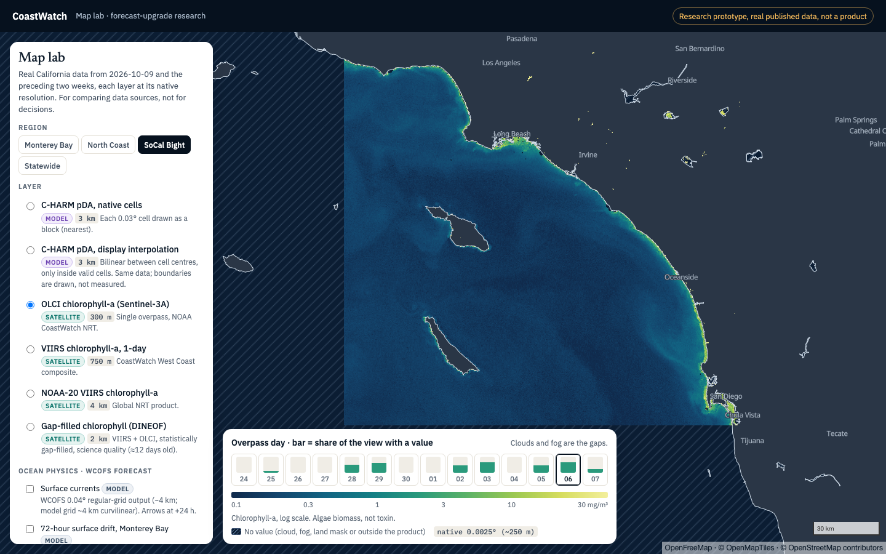 | 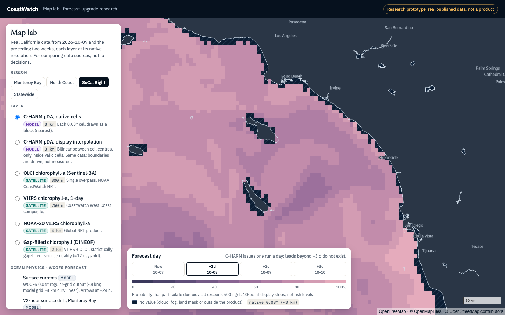 |
| North Coast: OLCI 300 m, 2026-10-01 (83 % clear) | North Coast: C-HARM native |
| 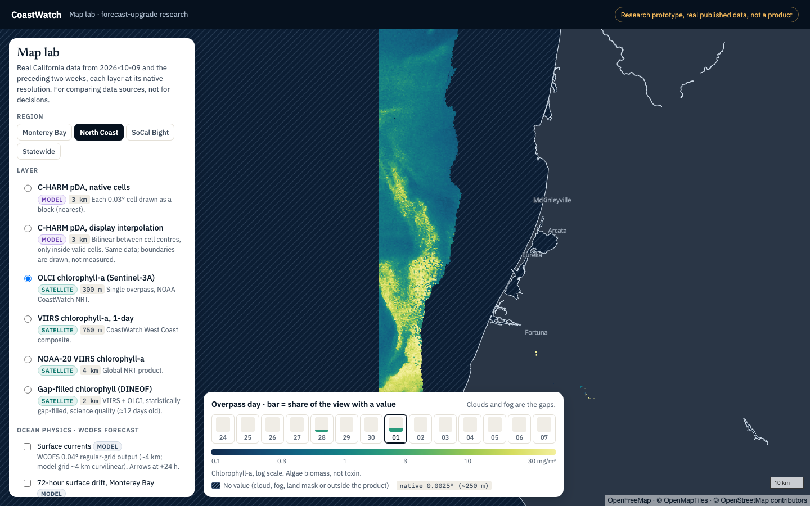 | 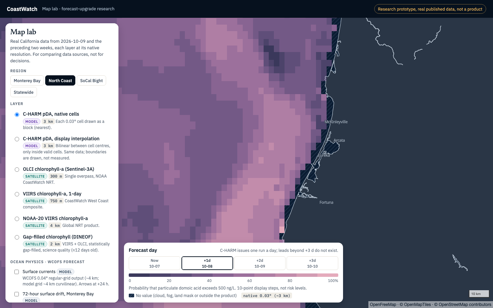 |

Statewide C-HARM with WCOFS current arrows: 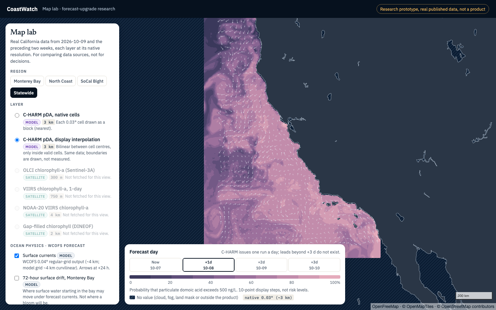

- **SoCal Bight.** OLCI resolves the narrow nearshore chlorophyll band from Malibu to San Diego and around Catalina and San Clemente islands. C-HARM has values for only 17 % of water within 1 km of shore there (§2.3).
- **North Coast.** The clear OLCI swath shows a sharp nearshore band along the Humboldt coast. The North Coast had only one usable day in two weeks.

## Design trade-offs

| Technique | Benefit | Risk | Recommendation |
|---|---|---|---|
| Nearest-neighbour cells at native resolution | Honest; every pixel is a real value | Blocky at harbour zoom for 3–4 km products | **Default for all layers** |
| Display interpolation between cell centres (C-HARM) | Calmer, contour-like bands | Implies continuity below 3 km; same data | Offer only as a labelled style at regional zoom. Never for readouts. **Not needed** once a fine observation layer exists. |
| Opaque raster + hatched no-data | Legend colours equal map colours; missing ≠ low | Hatching is busy along masked coastlines | **Adopt** (already in design revision 2) |
| Per-day coverage bars on the time slider | Shows cloud gaps before you click | Adds a row of UI | **Adopt** for satellite layers |
| "Latest clear view" composite (each pixel's most recent valid value within N days, with its age) | Fills fog gaps with real, dated observations | Mixes days; must show age | **Adopt with an age layer.** Max 7 days, no age-free colour. |
| Gap-filled fields (DINEOF) | Complete maps | Values are estimates, 12 days old for 2 km | Methods context only, not the default |
| Current arrows | Physical context for transport and upwelling | Clutter; implies precision at 4 km | Optional layer, thinned, low contrast, 4 km chip |
| Drift paths / particle animation | Intuitive, beautiful | Easily mistaken for a bloom forecast | Only with the label "where surface water may move · not where a bloom will be". Stops at land. 72 h max with WCOFS. |
| Advecting 300 m imagery forward | Looks like a high-resolution forecast | **Fabricates precision** (4 km currents) and ignores growth and decay | **Do not ship** |

The map lab is desktop only. The mobile pattern from design revision 2 (bottom sheet, place button, compact
legend) applies to these layers unchanged.
